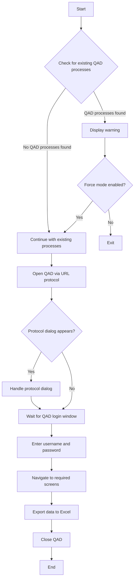
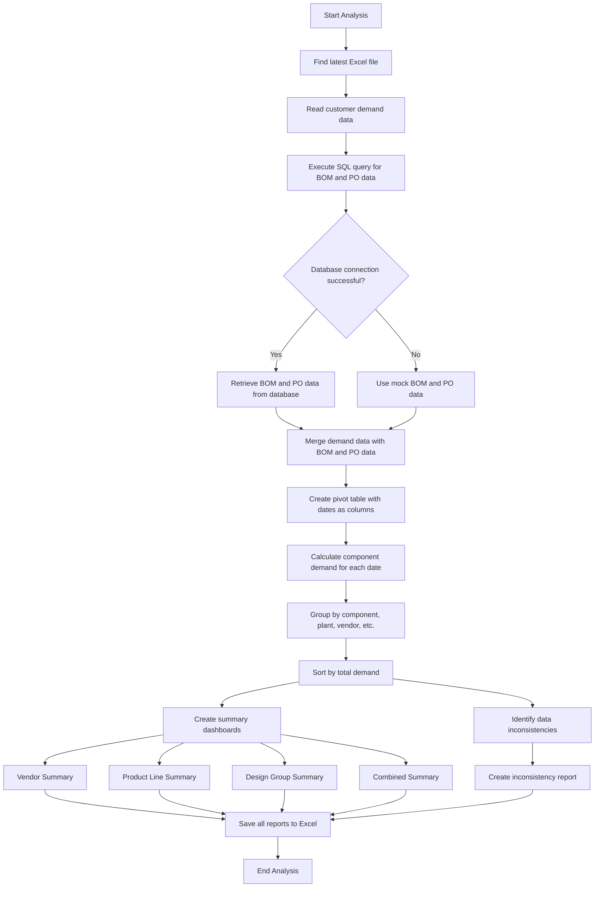

# QAD Automation Workflow

```mermaid
graph TD
    A[Start] --> B{Force Option?}
    B -->|Yes| G[Initialize Edge WebDriver]
    B -->|No| C[Check for Existing QAD Processes]
    C --> D{QAD Running?}
    D -->|Yes| E[Show Warning Popup]
    E --> F{User Response}
    F -->|OK| H[Wait for Processes to Close]
    H --> C
    F -->|Cancel| Z[Exit]
    D -->|No| G
    G --> I[Start QAD via URL Protocol]
    I --> J[Store Existing QAD Window List]
    J --> K[Navigate to QAD URL with State ID]
    K --> L[Handle Protocol Dialog]
    L --> M[Press Tab to Focus Open Button]
    M --> N[Press Enter to Click Open]
    N --> O[Wait for QAD Login Window]
    O --> P[Enter Username]
    P --> Q[Tab to Password Field]
    Q --> R[Enter Password]
    R --> S[Press Enter to Submit]
    S --> T[Wait 20 Seconds for QAD to Load]
    T --> U[Start Excel Export Process]
    U --> V[Wait 20 Seconds for QAD Menu to Load]
    V --> W[Identify Newly Opened QAD Window]
    W --> X[Focus Identified Window]
    X --> Y[Press Alt]
    Y --> AA[Press Enter]
    AA --> BB[Press Down Arrow + Enter]
    BB --> CC[Press Down Arrow + Enter]
    CC --> DD[Wait for Excel to Open]
    DD --> EE[Find Latest Excel File]
    EE --> FF[Read Customer Demand Data]
    FF --> GG[Execute SQL Query for BOM and PO Data]
    GG --> HH[Analyze Demand with BOM and PO]
    HH --> II[Generate Component Demand Report with Summary Dashboards]
    II --> JJ[End]

    style A fill:#f9f,stroke:#333,stroke-width:2px
    style JJ fill:#f9f,stroke:#333,stroke-width:2px
    style B fill:#ffd700,stroke:#333,stroke-width:2px
    style D fill:#ffd700,stroke:#333,stroke-width:2px
    style F fill:#ffd700,stroke:#333,stroke-width:2px
    style W fill:#ffd700,stroke:#333,stroke-width:2px
    style GG fill:#90ee90,stroke:#333,stroke-width:2px
    style HH fill:#90ee90,stroke:#333,stroke-width:2px
    style II fill:#90ee90,stroke:#333,stroke-width:2px
```

## QAD Login and Data Export Process

## Data Analysis Process

## Step Details

1. **Force Option**: Skip QAD process check if force flag is provided
2. **Process Check**: Verify no existing QAD processes are running (unless force option used)
3. **Initialize**: Set up Edge WebDriver and prepare automation environment
4. **Window Tracking**: 
   - Store list of existing QAD windows before starting new instance
   - Identify newly opened window by comparing before/after window lists
5. **URL Protocol**: Use `qadsh://browse/invoke` with state-id parameter
6. **Protocol Dialog**: 
   - Press Tab to focus on Open button
   - Press Enter to click Open
7. **Login Process**: 
   - Wait for login window
   - Enter username
   - Tab to password field
   - Enter password
   - Press Enter to submit
   - Wait 20 seconds for QAD to load
8. **Export Process**: 
   - Wait 20 seconds for QAD menu to fully load
   - Focus specifically on the newly opened QAD window
   - Press Alt to open menu
   - Press Enter to select first menu item
   - Press Down Arrow + Enter to navigate submenus
   - Wait for Excel file to open
9. **Data Analysis**:
   - Find the latest exported Excel file in the Shell temp directory
   - Read customer demand data from the Excel file
   - Execute SQL query to retrieve BOM and PO data
   - Join demand data with BOM and PO data to calculate component demand
   - Generate and save component demand report with summary dashboards

## Error Handling

- Optional process verification with force flag
- User interaction for closing existing QAD instances
- Detailed logging at each step
- Fallback to mock data if database connection fails
- Handling of missing BOM data for parts

## State Management

- Tracks existing QAD processes
- Maintains list of QAD windows before and after launching new instance
- Identifies newly opened window for export operations
- Ensures proper window focus
- Handles keyboard navigation sequence

## Command Line Options

### QAD Automation Script
- `--username`: QAD username
- `--password`: QAD password
- `--state-id`: QAD state ID for custom folder navigation
- `--force`: Force execution even if QAD processes are running

### Data Analysis Script
- `--excel-dir`: Directory containing the exported Excel files
- `--sql-file`: SQL file with BOM and PO queries
- `--output`: Output file for component demand report
- `--db-server`: Database server name
- `--db-name`: Database name
- `--verbose`: Enable verbose logging

## Report Sheets

### Component Demand
- Detailed component demand with dates and quantities
- Includes component description, vendor, product line, and design group

### Demand Timeline
- Pivot table showing demand timeline for each component
- Dates as columns with quantities

### Summary Dashboards
- **Vendor Summary**: Total demand per vendor
- **Product Line Summary**: Total demand per product line
- **Design Group Summary**: Total demand per design group
- **Combined Summary**: Total demand per vendor and product line combination

### Inconsistency Report
- Identifies components where:
  - Part master vendor (pt_vend) doesn't match purchase order vendor (po_vend)
  - Part master buyer (pt_buyer) doesn't match purchase order buyer (pod__chr08)
- Flags inconsistencies for easy identification
- Helps maintain data integrity and accuracy
