# QAD Automation Workflow

```mermaid
graph TD
    A[Start] --> B0[Check Edge Browser Status]
    B0 -->|Not Running| C0[Start Edge Browser]
    C0 -->|Failed| Z[Exit]
    C0 -->|Success| B
    B0 -->|Running| B
    B{Force Option?}
    B -->|Yes| G[Initialize Edge WebDriver]
    B -->|No| C[Check for Existing QAD Processes]
    C --> D{QAD Running?}
    D -->|Yes| E[Show Warning Popup with Process List]
    E --> F{User Response}
    F -->|OK| H[Wait for Processes to Close]
    H --> I{Processes Closed?}
    I -->|Yes| G
    I -->|No| E
    F -->|Cancel| Z[Exit]
    D -->|No| G
    G --> J0[Load QAD URL from URLs.md]
    J0 --> J[Start QAD via URL Protocol]
    J --> K[Navigate to QAD URL with State ID]
    K --> L[Handle Protocol Dialog]
    L --> M[Press Tab to Focus Open Button]
    M --> N[Press Enter to Click Open]
    N --> O[Wait for QAD Login Window]
    O --> P[Enter Username]
    P --> Q[Tab to Password Field]
    Q --> R[Enter Password]
    R --> S[Press Enter to Submit]
    S --> T[Wait 30 Seconds for QAD to Load]
    T --> U[Start Excel Export Process]
    U --> V[Wait 30 Seconds for QAD Menu to Load]
    V --> W[Find QAD Windows]
    W --> X[Focus First QAD Window]
    X --> Y[Press Alt]
    Y --> AA[Press Enter]
    AA --> BB[Press Down Arrow + Enter]
    BB --> CC[Press Down Arrow + Enter]
    CC --> DD[Wait for Excel to Open]
    DD --> EE[Press Alt]
    EE --> FF[Press F]
    FF --> GG[Press A]
    GG --> HH[Press Y]
    HH --> II[Press 3]
    II --> JJ[Type EDI_Demand]
    JJ --> KK[Press Enter]
    KK --> LL[Press Tab]
    LL --> MM[Press Enter]
    MM --> NN[Wait 2 Seconds]
    NN --> OO[Press Alt]
    OO --> PP[Press F]
    PP --> QQ[Press C]
    QQ --> RR[Execute SQL Query for BOM and PO Data]
    RR --> SS[Analyze Demand with BOM and PO]
    SS --> TT[Generate Component Demand Report]
    TT --> UU[End]

    style A fill:#f9f,stroke:#333,stroke-width:2px
    style UU fill:#f9f,stroke:#333,stroke-width:2px
    style B0 fill:#ffd700,stroke:#333,stroke-width:2px
    style B fill:#ffd700,stroke:#333,stroke-width:2px
    style D fill:#ffd700,stroke:#333,stroke-width:2px
    style F fill:#ffd700,stroke:#333,stroke-width:2px
    style I fill:#ffd700,stroke:#333,stroke-width:2px
    style J0 fill:#90ee90,stroke:#333,stroke-width:2px
    style W fill:#ffd700,stroke:#333,stroke-width:2px
    style RR fill:#90ee90,stroke:#333,stroke-width:2px
    style SS fill:#90ee90,stroke:#333,stroke-width:2px
    style TT fill:#90ee90,stroke:#333,stroke-width:2px
```

## Pre-requisites Check

1. **Edge Browser Status**:
   - Check if Microsoft Edge is running
   - If not running:
     - Attempt to get Edge installation path from registry
     - Start Edge browser process
     - Wait for Edge to initialize (up to 10 retries)
     - Verify Edge is running properly
   - If Edge cannot be started:
     - Log error and exit process
   - If Edge is already running:
     - Proceed with QAD automation

2. **QAD Process Check**:
   - Check for existing QAD processes
   - If processes are found and force option is not used:
     - Show warning popup with list of processes
     - Wait for user to close processes
     - Verify processes are closed
   - If no processes or force option is used:
     - Proceed with automation

3. **QAD URL Loading**:
   - Load QAD URL from URLs.md file
   - Use the EDI_Customer state ID from the URL
   - Ensure URL is properly formatted with state-id parameter

4. **Excel Export Process**:
   - Wait for QAD menu to load (30 seconds)
   - Find and focus QAD window
   - Press Alt to open menu
   - Press Enter to select first menu item
   - Press Down Arrow + Enter twice to navigate
   - Wait for Excel to open
   - Press Alt > F > A to open Save As dialog
   - Press Y > 3 to select Excel format
   - Type "EDI_Demand" as filename
   - Press Enter to confirm name
   - Press Tab > Enter to handle any overwrite prompt
   - Wait 2 seconds for save to complete
   - Press Alt > F > C to close Excel

## Error Handling

- Detailed QAD process verification with user interaction
- Logging of all steps and potential errors
- Graceful cleanup of resources on exit
- Automatic retry mechanisms for critical operations
- User notification for manual intervention when needed

## Key Timings

- Edge initialization: 5-10 seconds
- QAD startup: 30 seconds
- Menu load: 30 seconds
- Excel operations: 2-5 seconds per action
- Save completion: 2 seconds
- Process cleanup: 1-2 seconds
