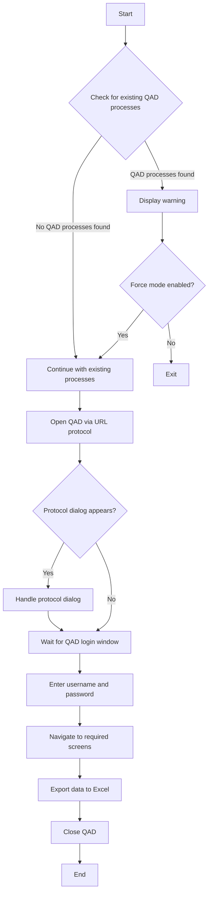
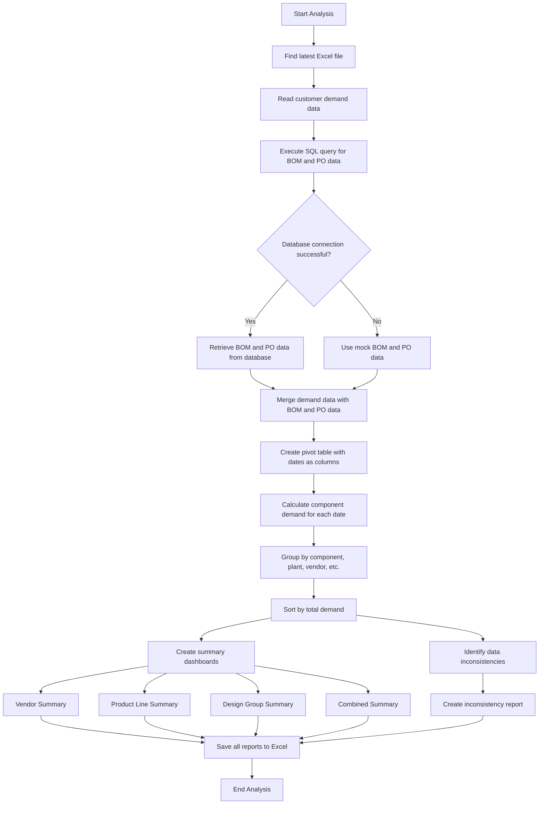

# QAD Automation Workflow

```mermaid
graph TD
    A[Start] --> B{Force Option?}
    B -->|Yes| G[Initialize Edge WebDriver]
    B -->|No| C[Check for Existing QAD Processes]
    C --> D{QAD Running?}
    D -->|Yes| E[Show Warning Popup with Process List]
    E --> F{User Response}
    F -->|OK| H[Wait for Processes to Close]
    H --> I{Processes Closed?}
    I -->|Yes| G
    I -->|No| E
    F -->|Cancel| Z[Exit]
    D -->|No| G
    G --> J[Start QAD via URL Protocol]
    J --> K[Navigate to QAD URL with State ID]
    K --> L[Handle Protocol Dialog]
    L --> M[Press Tab to Focus Open Button]
    M --> N[Press Enter to Click Open]
    N --> O[Wait for QAD Login Window]
    O --> P[Enter Username]
    P --> Q[Tab to Password Field]
    Q --> R[Enter Password]
    R --> S[Press Enter to Submit]
    S --> T[Wait 30 Seconds for QAD to Load]
    T --> U[Start Excel Export Process]
    U --> V[Wait 30 Seconds for QAD Menu to Load]
    V --> W[Find QAD Windows]
    W --> X[Focus First QAD Window]
    X --> Y[Press Alt]
    Y --> AA[Press Enter]
    AA --> BB[Press Down Arrow + Enter]
    BB --> CC[Press Down Arrow + Enter]
    CC --> DD[Wait for Excel to Open]
    DD --> EE[Find Latest Excel File]
    EE --> FF[Read Customer Demand Data]
    FF --> GG[Execute SQL Query for BOM and PO Data]
    GG --> HH[Analyze Demand with BOM and PO]
    HH --> II[Generate Component Demand Report with Summary Dashboards]
    II --> JJ[End]

    style A fill:#f9f,stroke:#333,stroke-width:2px
    style JJ fill:#f9f,stroke:#333,stroke-width:2px
    style B fill:#ffd700,stroke:#333,stroke-width:2px
    style D fill:#ffd700,stroke:#333,stroke-width:2px
    style F fill:#ffd700,stroke:#333,stroke-width:2px
    style I fill:#ffd700,stroke:#333,stroke-width:2px
    style W fill:#ffd700,stroke:#333,stroke-width:2px
    style GG fill:#90ee90,stroke:#333,stroke-width:2px
    style HH fill:#90ee90,stroke:#333,stroke-width:2px
    style II fill:#90ee90,stroke:#333,stroke-width:2px
```

## QAD Login and Data Export Process

## Data Analysis Process

## Step Details

1. **QAD Process Check**:
   - Check for existing QAD and related processes (QAD, Progress, SQL Server)
   - If processes found, display detailed warning with process names and PIDs
   - Prompt user to close all QAD applications
   - After user clicks OK, verify that processes are actually closed
   - If processes still running, prompt user again
   - Continue this loop until all QAD processes are closed or user cancels

2. **Force Option**: 
   - Skip QAD process check if force flag is provided
   - Use with caution as it may cause conflicts with running QAD instances

3. **Initialize**: 
   - Set up Edge WebDriver and prepare automation environment
   - Configure Edge with protocol handlers and user profile

4. **Window Tracking**: 
   - Find QAD windows using multiple title patterns
   - Connect to the first available QAD window for export operations

5. **URL Protocol**: 
   - Use `qadsh://browse/invoke` with state-id parameter
   - Default state-id: `413cf726-8a34-49b5-a9ee-02f9bffa42fc` (EDI_Customer)
   - Custom state-id can be provided via command line

6. **Protocol Dialog**: 
   - Wait 5 seconds for protocol dialog to appear
   - Press Tab to focus on Open button
   - Press Enter to click Open
   - Wait 5 seconds for QAD to start

7. **Login Process**: 
   - Wait for login window to appear (searches for windows with "Login" in title)
   - If standard login window not found, try alternative method to find QAD windows
   - Set focus on the login window
   - Enter username (no need to click, focus is already on username field)
   - Press Tab to move to password field
   - Enter password
   - Press Enter to submit login form
   - Wait 30 seconds for QAD to fully load

8. **Export Process**: 
   - Wait 30 seconds for QAD menu to fully load
   - Find all QAD windows using various title patterns
   - Connect to the first QAD window found
   - Set focus on the QAD window
   - **STEP 12**: Press Alt key (%) to open the main menu
   - Wait 2 seconds for menu to appear
   - **STEP 13**: Press Enter to select first menu item
   - Wait 2 seconds for submenu to appear
   - **STEP 14**: Press Down Arrow and Enter to navigate to export
   - Wait 2 seconds for export submenu to appear
   - **STEP 15**: Press Down Arrow and Enter again for Excel export
   - Wait 5 seconds for Excel export dialog
   - **STEP 16**: Wait 10 seconds for Excel file to open
   - **STEP 17**: Wait additional 5 seconds for Excel file to be saved

## Detailed QAD Navigation Sequence

### QAD Login Sequence
1. QAD is launched via URL protocol: `qadsh://browse/invoke?state-id=<state-id>`
2. Edge browser opens with protocol handler dialog
3. Tab key is pressed to focus on "Open" button
4. Enter key is pressed to launch QAD
5. QAD login window appears
6. Username is entered in the username field
7. Tab key is pressed to move to password field
8. Password is entered in the password field
9. Enter key is pressed to submit login form
10. QAD loads main interface (30 second wait)

### QAD Export Sequence
1. Wait 30 seconds for QAD menu to fully load
2. QAD main window is identified and focused
3. Alt key (%) is pressed to open the main menu
   - This activates the top menu bar in QAD
4. Enter key is pressed to select the first menu item
   - This selects the first option in the menu bar
5. Down Arrow + Enter is pressed to navigate to export
   - This navigates through the submenu
6. Down Arrow + Enter is pressed again to select Excel export
   - This initiates the Excel export process
7. Excel file opens automatically (10 second wait)
8. Additional 5 second wait ensures file is fully saved

### Keyboard Navigation Keys
- **Tab**: Move focus to next control
- **Enter**: Activate focused control
- **Alt (%)**: Open main menu
- **Down Arrow**: Navigate down in menus
- **{DOWN}{ENTER}**: Press Down Arrow then Enter (combined action)

## Error Handling

- Detailed QAD process verification with user interaction
- Verification loop ensures QAD processes are actually closed
- Optional process verification bypass with force flag
- User interaction for closing existing QAD instances
- Detailed logging at each step
- Fallback to mock data if database connection fails
- Handling of missing BOM data for parts
- Multiple retry attempts for URL navigation
- Alternative window detection methods if standard methods fail
- Screenshot capture on error for debugging

## State Management

- Tracks existing QAD processes
- Maintains list of QAD windows before and after launching new instance
- Identifies newly opened window for export operations
- Ensures proper window focus
- Handles keyboard navigation sequence
- Uses persistent Edge profile to maintain sessions

## Command Line Options

### QAD Automation Script
- `--username`: QAD username
- `--password`: QAD password
- `--state-id`: QAD state ID for custom folder navigation
- `--force`: Force execution even if QAD processes are running

### Data Analysis Script
- `--excel-dir`: Directory containing the exported Excel files
- `--sql-file`: SQL file with BOM and PO queries
- `--output`: Output file for component demand report
- `--db-server`: Database server name
- `--db-name`: Database name
- `--verbose`: Enable verbose logging

## Report Sheets

### Component Demand
- Detailed component demand with dates and quantities
- Includes component description, vendor, product line, and design group

### Demand Timeline
- Pivot table showing demand timeline for each component
- Dates as columns with quantities

### Summary Dashboards
- **Vendor Summary**: Total demand per vendor
- **Product Line Summary**: Total demand per product line
- **Design Group Summary**: Total demand per design group
- **Combined Summary**: Total demand per vendor and product line combination

### Inconsistency Report
- Identifies components where:
  - Part master vendor (pt_vend) doesn't match purchase order vendor (po_vend)
  - Part master buyer (pt_buyer) doesn't match purchase order buyer (pod__chr08)
- Flags inconsistencies for easy identification
- Helps maintain data integrity and accuracy
